# Qubic

All the latest information you can find on the official website [qubic.wiki](http://www.qubic.wiki)

# Table of Contents

> 1. [Qubic a quorum-based computations protocol](#qubic-protocol)
> 2. [Hardware Requirements](#hardware-requirements)
> 3. [Software Requirements](#software-requirements)
> 4. [The steps we will take to achieve a successful running efi application](#steps)
> 5. [Before we start read very carefully](#before-start)
> 6. [Preparing motherboard and bios settings](#preparing-motherboard)
> 7. [Code modifications](#code)
>    1. [Seeds](#code-seeds)
>    2. [Browser](#code-browser)
> 8. [Preparing an USB stick to run Qubic](#preparing-usb)
>    1. [Set writing privileges with DISK PART](#disk-part)
>    2. [File placement USB](#usb-files)
> 9. [Roles](#roles)
>    1. [Register](#roles-register)
>    2. [Unregister](#roles-unregister)
>    3. [Poll](#roles-poll)
> 10. [Troubleshooting](#troubleshooting)

---
   


<a name="qubic-protocol"></a>
# Qubic a quorum-based computations protocol.

In this tutorial we'll setup a [Qomputor](https://www.computors.org/computing/qomputor "Qomputor") Node (Mining node needs slightly different approach and will be covered later), we try to make this tutorial as easy as possible but some knowledge of computer systems is definitely required. This tutorial is a community initiative. For more information or questions join [Syzygy Discord ](https://discord.gg/2vDMR8m "Syzygy Discord").

Qubic software is running on baremetal machines without any OS installed, the software is a so called UEFI application and for security reasons we compile it ourselves with the .cpp files provided by [Come-from-Beyond](https://twitter.com/c___f___b "Twitter"). The latest releases will always be on [Syzygy Discord ](https://discord.gg/2vDMR8m "Syzygy Discord").

Because we use a UEFI application, the successful use of the software is very dependent on the system that is used. Here are some examples of motherboard/cpu combinations that have been tested and which are working successfully.

| Motherboard        | CPU         | RAM  | Connection |
| ------------------ |:-----------:| ----:| -------:   |
| MSI B450-A PRO MAX | Ryzen 3950x | 64GB | 1gbps up/down |

For now, the exact conditions for a successful system are not yet available. 

<a name="hardware-requirements"></a>
# Hardware Requirements
* Highend CPU
* Motherboard which accept UEFI software (disable secure boot)
* 64GB Ram
* 1GBps internet connection
* 128GB USB Stick (Hard Drive recommended for faster write speeds, SATA Drives ensures higher compatibility)

<a name="software-requirements"></a>
# Software Requirements
* Qubic.cpp file
* [Visual Studio Code Community 2022](https://visualstudio.microsoft.com/vs)
* [Rufus](https://rufus.ie)
* Qubic Qomputor files (system.data, ledger.data) check discord for latest info.
* Qubic Miner files (mining.data, solution.data) check discord for latest info.
* Open port 21841
* Open port 80 (required so clients can connect)

<a name="steps"></a>
# The steps we will take to achieve a successful running efi application

1. Prepare motherboard/bios settings
3. Compiling Qubic
4. Prepare USB / Hard Drive
5. Run

<a name="before-start"></a>
# Before we start read very carefully.
As a community or as an individual, we are in no way responsible for losing passwords or losing money. We assume that self-research is being done and that the common sense of an individual does its job. No rights can be obtained from its contents, nor is it meant as personal or professional advice. Also check if this info is up to date or even outdated.

<a name="preparing-motherboard"></a>
# Preparing motherboard and bios settings 
Since every motherboard is different, it is advisable to consult the manual if you cannot find certain settings. There are a number of important things that need to be set up.

1. Make sure motherboard can run or boot with UEFI
2. Disable secure boot
3. Change boot order to USB (uefi)
4. Set time to UTC TIME (do not use +0 as your computer should not respect daylight savings)
5. Make sure network stack is available in BIOS if not you will need to load your network driver manually. (Check [troubleshooting](#troubleshooting) section)

<a name="compiling"></a>
# Compiling Qubic with Visual Studio Code Community 2022

1. Install Visual Studio Code Community 2022, while installing make sure the Desktop Development with C++ components are installed. If you already had installed Visual Studio Code you install the components at Tools >> Get Tools and Features.


2. When we start Visual Studio we need to create a new project make sure you use the following settings.


3. Give the project a name


4. When the project file is succesfully made and opened we are going to add the latest .cpp file from our [Discord Server](https://discord.gg/2vDMR8m "Syzygy Discord"). ( they are in the #qubic channel in the pinnend messages.)


5. When downloaded load it in the project.


<a name="computor-or-miner"></a>
6. When the file is imported we are going to setup our personal settings. **(At this stage we can specify if we want the system to run as a computor or as a miner to give more mining power to a computor see screenshot below)**


At number 1 we're specifying how many cores or threads should be mining (in the end Computor Nodes will do other tasks, before that we'll need 676 computors), read you manual from cpu to check. For now best results are (total threads - 3 threads, but its also machine dependent so play with it, some systems its better to do cores - 2), for now we leave computing threads as 1.

At number 2 we need to specify our secret [seeds](#code-seeds), '''make a 55 lowercase password and share it with no one anytime''' you are responsible for your own password and no one else. Write it down save it somewhere where noboby can find it, dont loose it.. We cant say this enough.

At number 3 we're going to setup our router settings (log in to your router to see if settings are matching, when you wanna run a public node make sure you forwarding port 80 and 21841 and disabling firewall settings and check if port is open. Enter the values as they are in your router also dont forget to specify public IP its necessary your're having a static IP address as a computor.

At number 4 we specify our COMPUTOR ID (its generated automatically when your're log in with earlier generated seed on the web client, its also provided in our [Discord Server](https://discord.gg/2vDMR8m "Syzygy Discord") also generate another 55 lowercase password and log in on the client this ID will be your operator ID with this we can look at statics on the webclient for more info or ask on Discord.

At number 5 we're specifying public IPs with the command /peerslist in channel #botbox on Discord you can retreive some IPs. 

So with everything setup, we're going to compile the .efi file. The next steps are very important to create a succesfull compiled file.

7. Make sure each following setting matches the settings in Visual Studio Code.


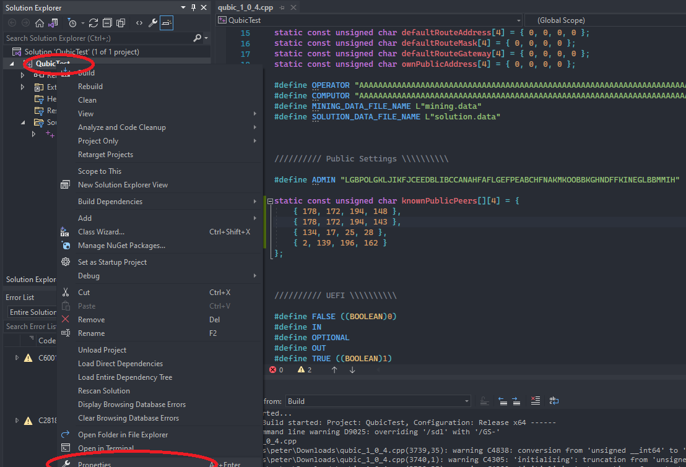

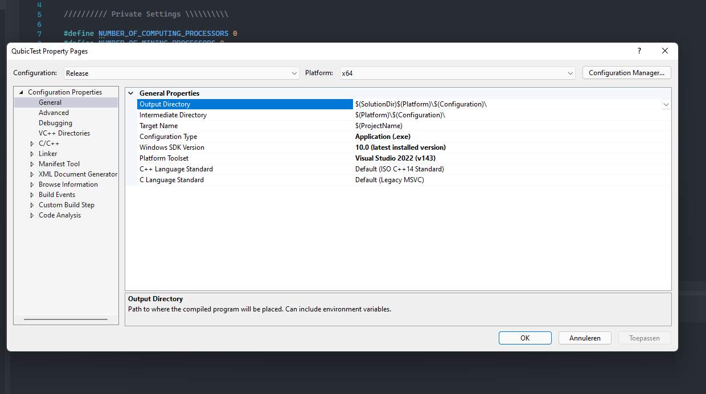

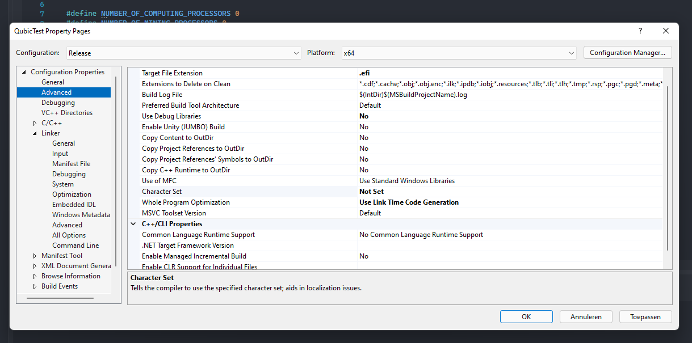

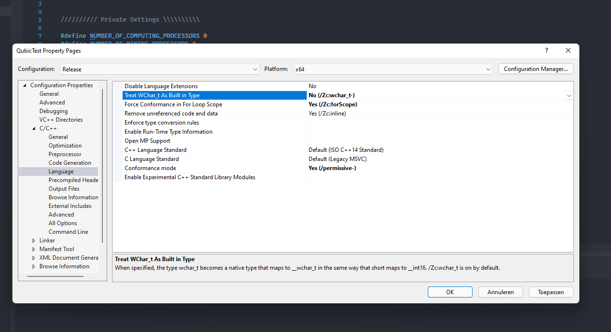

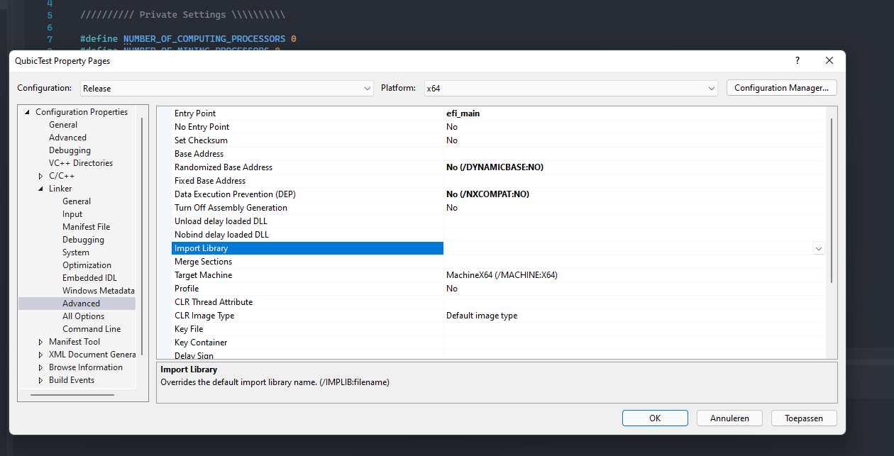

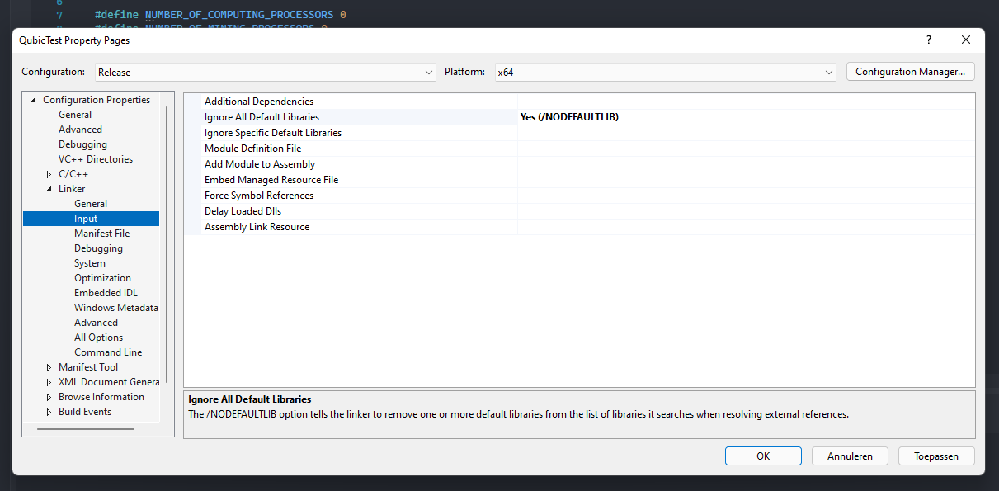

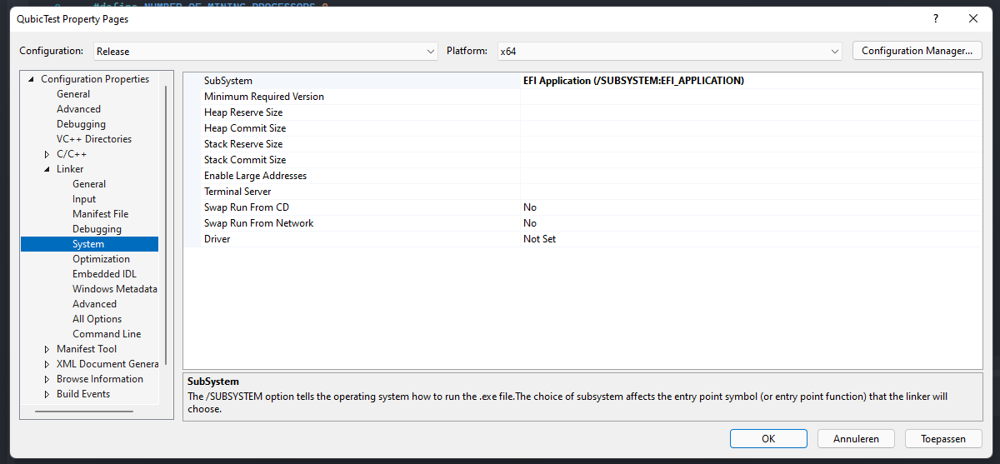

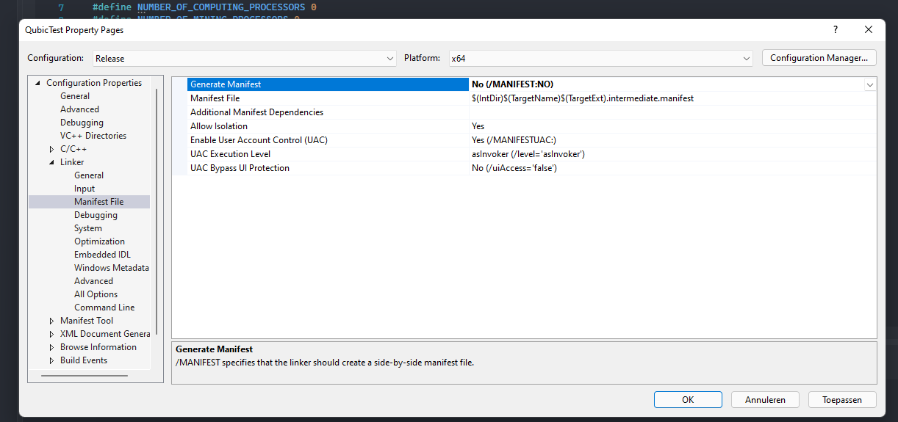

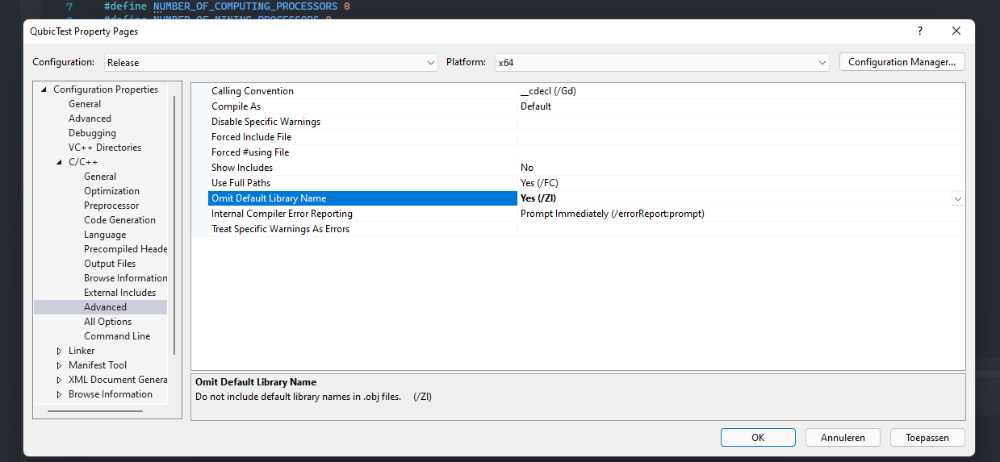

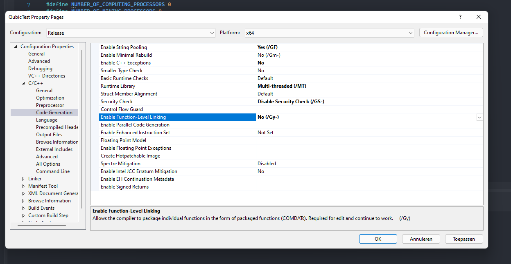

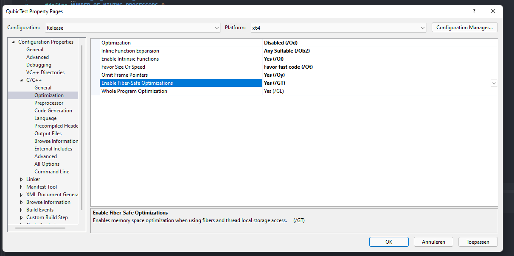

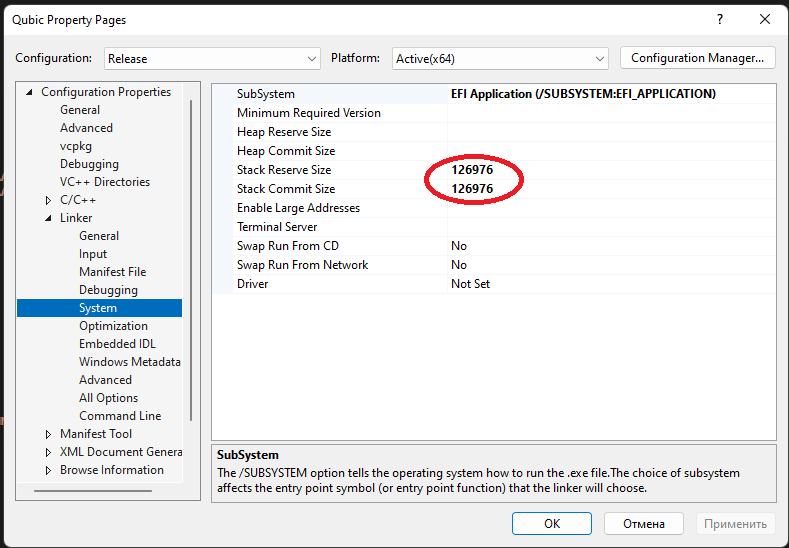

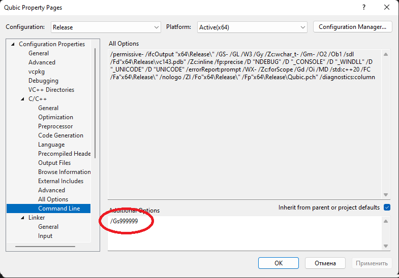

After al these settings we have set up, hit CTRL SHIFT + B, if every thing is fine you should see something like this in your Visual Studio Code screen.

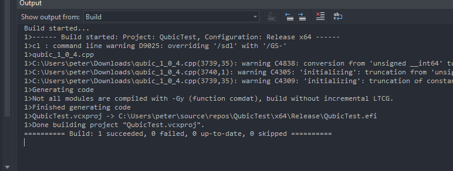


<a name="miner"></a>
# Miner setup

To run a miner system which can boost your computor score we need the same .cpp file provided by Come-from-Beyond as above. The only thing which is different are some settings. 

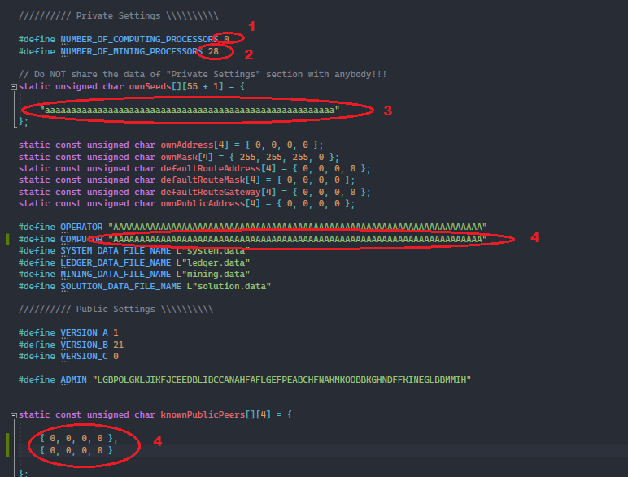

1. If you want to run a miner it is very important that there is no computing processor running, we set this value to 0
2. Define as much miner processors as possible (look at your cpu specifications to check how many threads or cores)
3. We are not running a computor so fill in 55x an lowercase a "aaaaaaaaaaaaaaaaaaaaaaaaaaaaaaaaaaaaaaaaaaaaaaaaaaaaaaa"
4. This is an important step because here we're going to define the ID we are mining for. Dont leave it as in screenshot but get the ID you want to mine for and fill it in here.
5. Just like a computor we can add some public IPs to connect to the network

<a name="code"></a>
# Code modifications

<a name="code-seeds"></a>
### Seeds

More than one seed can be entered into   
`static unsigned char ownSeeds[][55 + 1] = { "<seed>" };`  
`static unsigned char ownSeeds[][55 + 1] = { "<seed1>", "<seed2>", "<seed3>" };`  

In this case a single machine will be doing computor job once but signing the results with all listed seeds. Note that a failure of this machine will have negative impact on all computors whose seeds are used, so don't put too many seeds in one basket.

__Very important:__ There should be only 1 (one) machine in the universe with computor seed entered into ownSeeds, if there are more than one such machines that computor will likely face decimations (-10% to revenue multiple times) because of signing conflicting messages.

<a name="code-browser"></a>
### Browser

Requires port `80` to be open as well. Set `NUMBER_OF_CLIENT_CONNECTIONS` to `0` if you don't need to connect to your node with a browser.

<a name="preparing-usb"></a>
# Preparing an USB stick or SSD to run Qubic

## USB
Running the .efi application successfully, depends on the system (check tested motherboard/cpu section). Make sure the system has no access to other disks. Qubic needs to be running from USB FS0: and at the time of writing @N-010 at [Discord](https://discord.gg/2vDMR8m "Syzygy Discord") has written a solution to specify other disks, but this has not been tested by me. For example i needed to remove completely my SSD disk.

For now lets start. The .efi file created earlier should be in the folder you created the project, something like /QubicTest/x64/Release/QubicTest.efi

If you haven't downloaded [Rufus](https://rufus.ie) yet, do it now. Open and make the following changes.

1. Make sure to select your right USB at least 128GB
2. Download [UEFI SHELL](https://github.com/pbatard/UEFI-Shell/releases/download/21H2/UEFI-Shell-2.2-21H2-RELEASE.iso) and load it into Rufus
3. Set MBR
4. Set UEFI
5. Set FAT32
6. Press Start

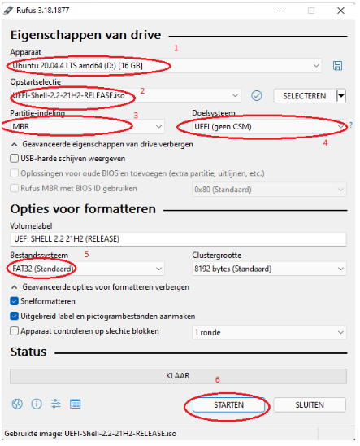


## SSD Drive

Make sure your system is always loading the right files from the right disk (for now not everybody is managed to setup successfully a SSD drive so this also is hard and software dependent)

1. Download the program guiformat.exe. (https://soft.mydiv.net/win/files-FAT32format.html)
2. Run it as administrator.
3. Select the desired ssd-drive and press the start button.
4. Add all required files to the drive as you would do with a normal USB.
5. Install the SSD in the computer or reboot the PC if you are using the same machine.
6. Go to BIOS
7. Boot from the SSD

<a name="create-partition"></a>
You can also try create a FAT32 partition in your hardrive for faster R/W speeds you can use Windows Built-in Disk Management , copy all contents to drive, and boot. Your BIOS should recognize it as en UEFI partition. 

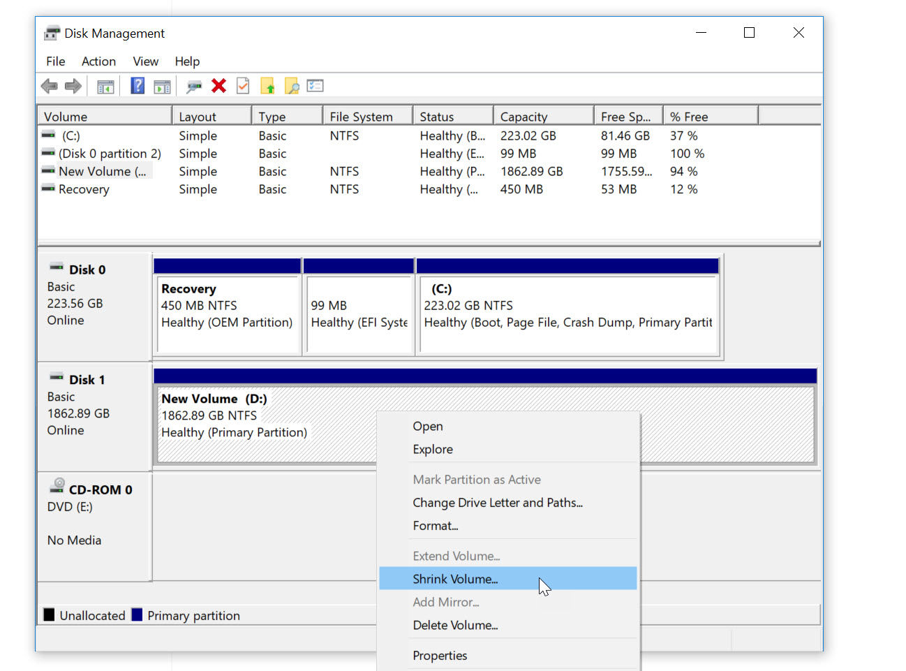

Note: If you are working with a NVMe hardrive, you may encounter issues, if so try to update your BIOS to latest version or find EFI drivers for your NVMe controller from your motherboard vendor's webpage.


<a name="disk-part"></a>
### Set writing privileges with DISK PART

After that make sure to do following steps so .efi can write to USB stick. Connect your write protected USB Stick to your computer.

Right Click on Start. Click Command Prompt (Admin). Click Yes in the UAC message.

Type **diskpart** and hit Enter.

Type **list disk** and hit Enter. 

Here, you’ll be able to see a list of storage media connected to your computer like your internal hard drive, SSD, pen drive, or USB Stick.
Type select **disk number of your disk**. Example, select disk 1 in my case. Make sure you enter the number correctly and don’t end up changing the attributes of your internal hard drive or any other storage media.

Type **attributes disk clear readonly** and press Enter.

Type **exit** and press Enter to get out of the diskpart utility. 

Type **exit** and press Enter again to get out of the command line.

<a name="usb-files"></a>
### How to place Qubic files on USB

Then we need to add some files like **solution.data**, **system.data**, **mining.data** and **QubicTest.efi** (the file we created earlier) these files should all be on the USB like the pictures below. (I called my project Qomputor, so the .efi file is called Qomputor.efi instead of QubicTest.efi)

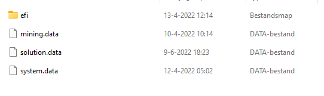

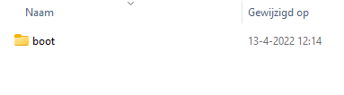

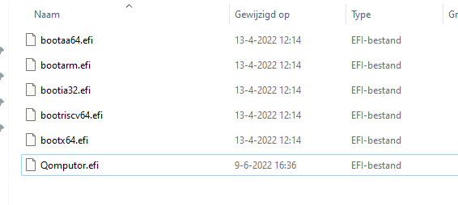

The file mining.data can be downloaded here [mining.data](https://mega.nz/file/QBc2SZKJ#hT3UF4MJgfZ2t-SiBF3gtafFyMdhf89cUKpvWgpM-OE "Mining Data") 

Additional we can create a file called **startup.nsh** with this file we can automate the startup process. The following lines can be added to this file:

```
@echo -off
cls
fs0:
timezone -s 0:00
cd efi/boot/
Qomputor.efi
```

This so called startup.nsh file needs to be placed also in the root folder of the USB.

So now when drivers are working, bios is set to UTC time, internet connection is working and you put in the USB to your system and booting it as first option it should start running. If you are having any problems join us at [Syzygy Discord ](https://discord.gg/2vDMR8m "Syzygy Discord") and ask in #qubic channel for help.

### USB port

If qubic does not start or freezes at the beginning, try using the USB 2.0 port

<a name="roles"></a>
# Roles

<a name="roles-register"></a>
### Register

To get the role of `Computor` you need to register with the bot `ComputorPollBot`. To do this, download the [html](https://discord.com/channels/768887649540243497/938806734212984853/943073346088734731) file  
Next, log on with the seed. Then enter a constant in the `message` field: `For ComputorPollBot from` and username type: `name#4444`. The result is a string: `For ComputorPollBot from N-010#3073`

Send the received message with the command `/register` to the bot in the **DM**<br></br>
Example:
```sh
/register {
    "identity": "BPFJANADOGBDLNNONDILEMAICAKMEEGBFPJBKPBCEDFJIALDONODMAIMDBFKCFEEMEOLFK",
    "message": "For ComputorPollBot from N-010#3073",
    "signature": "bhijbaejihfcgpbmoddoihhfhoapmdhnogkolnimfekndhpdddeddjfhopmdbacbjjcjcddmklmdkfeplkbdaiogdboobiiodmhndphmojnaeedcoaijnfpddebdaadg"
}
```

<a name="roles-unregister"></a>
### Unregister

With the command `/unregister` you can remove the ID. The body of the command is the same as that of `/register`<br></br>
Example:
```sh
/unregister {
    "identity": "BPFJANADOGBDLNNONDILEMAICAKMEEGBFPJBKPBCEDFJIALDONODMAIMDBFKCFEEMEOLFK",
    "message": "For ComputorPollBot from N-010#3073",
    "signature": "bhijbaejihfcgpbmoddoihhfhoapmdhnogkolnimfekndhpdddeddjfhopmdbacbjjcjcddmklmdkfeplkbdaiogdboobiiodmhndphmojnaeedcoaijnfpddebdaadg"
}
```

<a name="roles-poll"></a>
### Poll

Only users with the [Computor](#roles-register) role can create and take part in the poll. You can vote as many times as your IDs are computors  

#### Command
The `/poll` command is used to create a poll. It can only be used in the [polls](https://discord.com/channels/768887649540243497/995048638508191897) channel. The command accepts as arguments: the poll text and the voting options    
Example:
```
/poll "body" "var1" "var2" "var3" "var4" "var5"
```
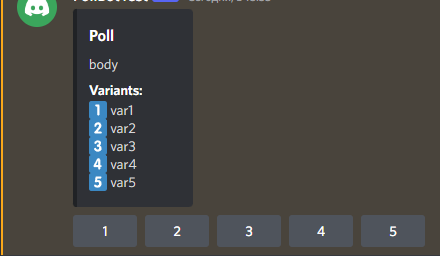

The maximum number of variants is 5  
By clicking on the voting button you give **all** your votes to this variant. The number of your votes is the number of IDs that are `computors`. The number of votes in unclosed polls may change when your IDs, which are computors, have increased or decreased. This can happen by changing epochs, you have registered or unregister IDs


<a name="troubleshooting"></a>
# Troubleshooting

If you are having problems making your network card to work you can load the drivers manually yourself.
Steps: 

1. Try to locate your network card model & vendor
2. Locate the driver from network-drivers folder (you can also search in Google if its not there) & unzip files to your USB/Drive inside a folder called **drivers**, if you have doubts you can add various models, the more drivers you load, the longer will take for startup
3. Adding to your **startup.nsh** file the following code just after the **fs0:** line:

```
cd drivers
load *
stall 5000000
ifconfig -l
cd ..
```
If successful, you should be seeing your network card details before qubic software starts.


